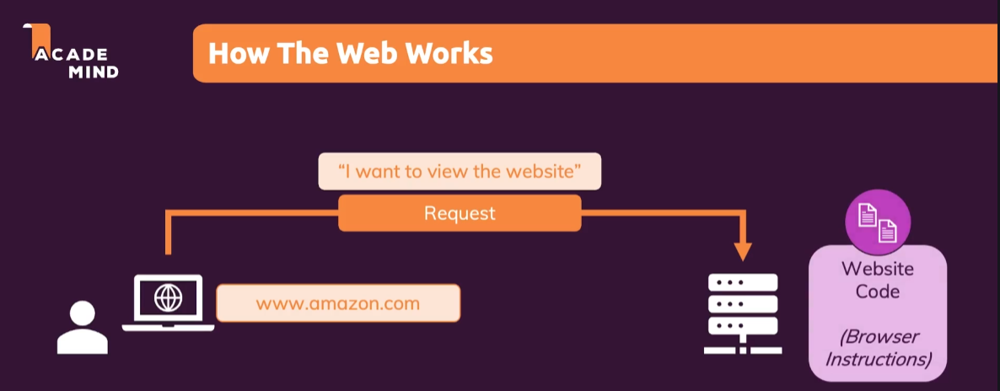
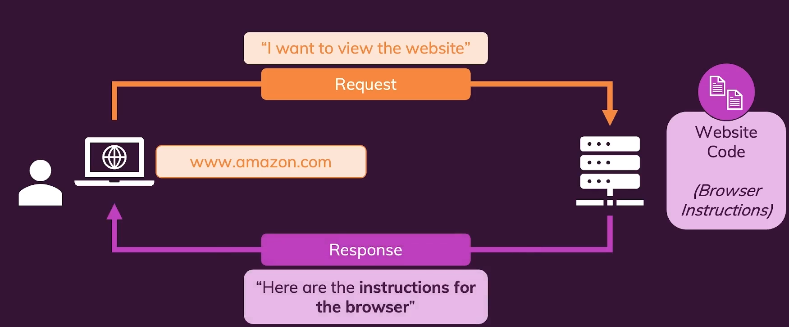
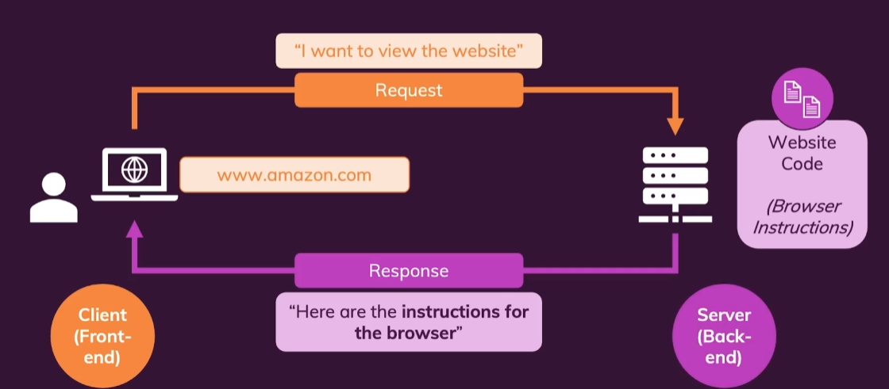
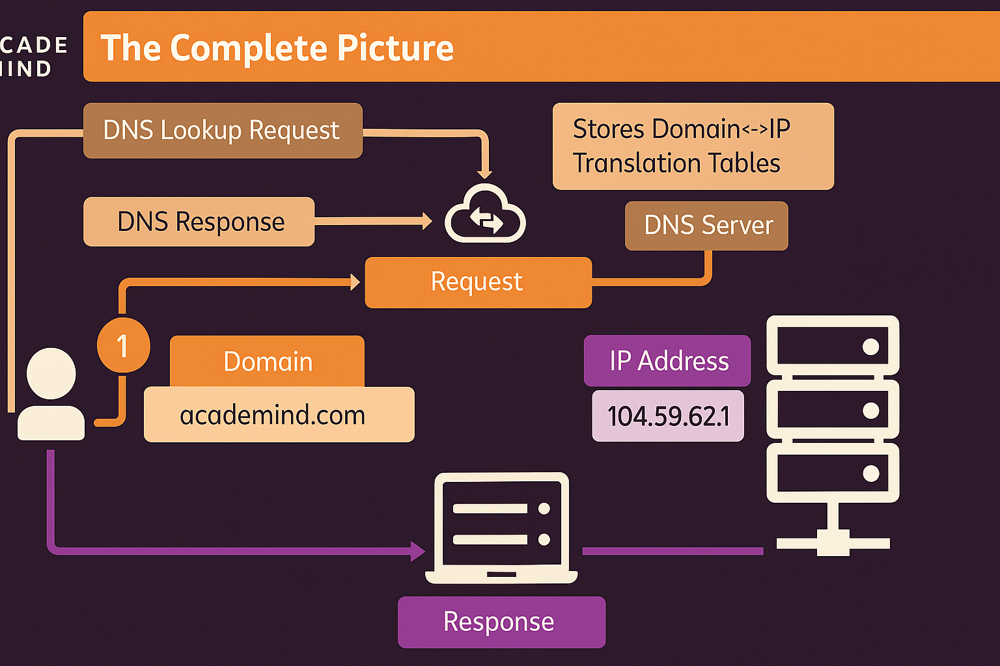

## 0. Introduction.

Hello everyone, I'm a guy who wants to become a founder(Korean).
I want to study programming diligently, but my willpower isn't very strong.
So, I've decided to write a blog every day for at least 1 to 100 days.
I think this Udemy course is suitable for me:
(https://www.udemy.com/course/100-2022-web-development/learn/lecture/30288870?start=0#overview)

If you want to contact me, send me a DM on Discord: `napfounder_52167`.

## 1.what is web devlopement?

Browsing the web is like calling a friend.
ex) [www.amazon.com](http://www.amazon.com) ⇒ URL
When we type that into the browser and press Enter, we (the client) send a request to a server computer (in this case, Amazon).
The way we communicate is through a protocol.

This protocol is standard(Default),

We call this protocal as HTTP or HTTP(the "S" means "secure")
Web development is the process of writing code for websites and applications that respond to the client’s browser.

This exchange happens incredibly fast — in milliseconds!!


For as a web dev knowing this protocol is important!

## 2. Which Programming Language we use?

HTML : Defines the content and structure of a web page.

CSS: Styles the content and layout of the page.

JavaScript : Adds interactivity and dynamic behavior to the website.

>Make website use this Three languages is basic <

## 3. How the web works

‘HTTP(S)’ is a protocol used for communication between a remote computer (client) and a server.

HTTP or HTTPS is used as the standard and is automatically added by your browser.

1. Domain : The human readable address
2. Path : A ‘pointer’ to a specific resource
    
    So website adress is like,  [https://domain.](https://domain.path)com/path 
    
- URL : (Uniform Resource Locator) is the address used to access resources on the internet

This protocol is ‘Super fast’ so most of it couldn’t recognize but you should know. 

"Just because someone knows your IP address doesn’t mean they can access your computer.”

Your computer blocks incoming traffic by default for security reasons.

- means

‘Ip’ = Internet Protocol

"DNS is the system that translates a domain name into an IP address using a DNS server.”

## 4. What is "www"?

"**www**" stands for **World Wide Web**, a term that was commonly used in the early days of the internet.

While you can often access the same website with or without the "www" prefix (e.g., amazon.com vs. [www.amazon.com](http://www.amazon.com/)),

technically, **"[www.amazon.com](http://www.amazon.com/)"** is a subdomain of the root domain **"amazon.com."**

Website operators can create various subdomains for their root domain.

Many websites register and configure the "www" subdomain to point to their main website.

However, it's not a requirement, and not all websites use it.

Nowadays, most users tend to enter only the root domain rather than manually typing "www."
## 5. Module content

1. Understanding HTML Elements 
2. Styling content with CSS
3. Adding interactivity with JavaScript
## 6. How to create a website

1. Your computer can act as a temporary **development server**.
- All you need is a **browser** and an **HTML file**.
    
    → Any browser works (e.g., Chrome).
    
- An HTML file is just a regular text file with a `.html` extension that contains HTML code.
## 7. print hello world in html
```html
<h1>hello world!</h1>
```
h1 means heading (h1 ~ h6)

- source code about this lecture, (https://github.com/academind/100-days-of-web-development/tree/02-html-css-basics)