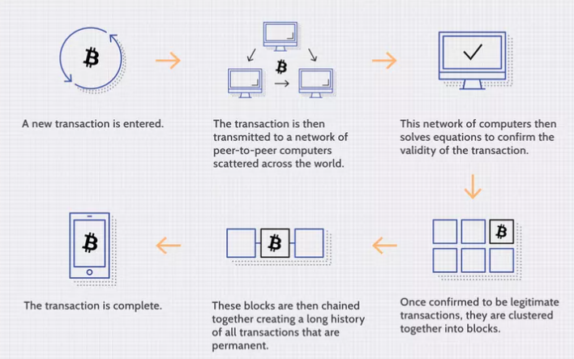
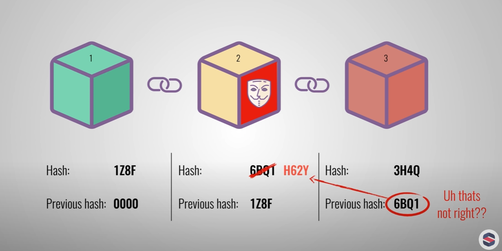

## This study is based on <a>https://roadmap.sh/blockchain</a> curriculum.

- This is a summary. (Highly recommended read this blog first, then watch the full context)
# What is Blockchain?

### 1. Blockchain Explained
A blockchain is a distributed database or ledger shared across a computer network's nodes.

"Blockchains are not limited to cryptocurrency uses."

Blockchains can be used to make data in any industry immutable—meaning it cannot be altered.

Since a block can’t be changed, 

the only trust required is at the point where a user or program enters data. 

This reduces the need for trusted third parties, 

such as auditors or other humans, who add costs and can make mistakes.

The key difference between a traditional database and a blockchain is how the data is structured and accessed.

The Bitcoin blockchain stores transactions in a 4MB file called a block. 

When the block is full, its data is put through a cryptographic hash function to create a unique code called the block header hash.

The hash is then entered into the following block header and encrypted with the other information in that block's header.

This process creates a chain of blocks, hence the name “blockchain.”

Not all blockchains follow this process. 

For instance, the Ethereum network randomly chooses one validator from all users with ether staked to validate blocks, which are then confirmed by the network. 

This is much faster and less energy-intensive than Bitcoin's process.

> How is Blockchain Decentralization Possible?

 For example, if someone tries to alter a record on one node, the other nodes would prevent it from happening by comparing block hashes. 
 
 This way, no single node can alter information within the chain.

> Is Blockchain Secure?
New blocks are always added to the "end" of the blockchain. 

After a block has been added to the end of the blockchain, previous blocks cannot be altered.

## 2. Detail about Blockchain
"Blockchain is a distributed ledger."
Each block contains data,its own hash, and the hash of previous block.

"The data usually includes the sender, receiver, and amount."

A hash is a unique value, like a fingerprint, that identifies a block.

If the data in a block changes, its hash will also change.

This prevents tampering with the blocks.

"Each block also contains the hash of the previous block."

But what about first block?

We call the first block the 'Genesis block'.

So Bitcoin uses PoW process and creates a block every 10 min.

"This makes tampering with the blockchain very diffcult."

It also uses P2P(peer to peer) network, so that every node can validate whether a block is legitimate.

If someone tries to tamper with the blockchain, they would need to control more than 51% of the network-a so-called 51% attack.

With the current level of computing power, this is almost impossible.

---

